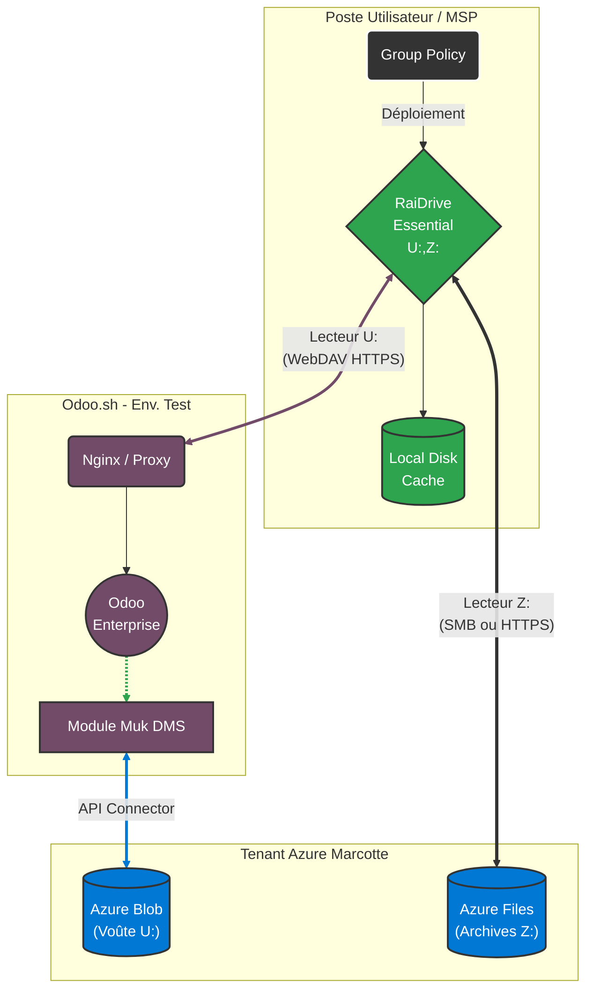

```mermaid

flowchart TB
	
    %% --- STYLES ---
    classDef azure fill:#0078D4,stroke:#333,stroke-width:2px,color:#fff;
    classDef odoo fill:#714B67,stroke:#333,stroke-width:2px,color:#fff;
    classDef local fill:#333,stroke:#fff,stroke-width:2px,color:#fff;
    classDef drive fill:#2ea44f,stroke:#333,stroke-width:2px,color:#fff;

    %% --- ZONE LOCALE ---
    subgraph Local [Poste Utilisateur / MSP]
        direction TB
        GPO(Group Policy):::local
        RD{RaiDrive<br/>Essential<br/>U:,Z:}:::drive
        LD[("Local Disk<br/>Cache")]:::drive
        GPO -->|Déploiement| RD
        RD --> LD
    end

    %% --- ZONE ODOO ---
    subgraph OdooEnv [Odoo.sh - Env. Test]
        direction TB
        Nginx(Nginx / Proxy):::odoo
        Odoo((Odoo<br/>Enterprise)):::odoo
        Muk[Module Muk DMS]:::odoo
        
        Nginx --> Odoo
        Odoo -.-> Muk
    end

    %% --- ZONE AZURE ---
    subgraph Cloud [Tenant Azure Marcotte]
        direction TB
        Blob[("Azure Blob<br/>(Voûte U:)")]:::azure
        Files[("Azure Files<br/>(Archives Z:)")]:::azure
    end

    %% --- FLUX LECTEUR U (ACTIF) ---
    RD <== "Lecteur U:<br/>(WebDAV HTTPS)" ==> Nginx
    Muk <== "API Connector" ==> Blob

    %% --- FLUX LECTEUR Z (ARCHIVES) ---
    RD <== "Lecteur Z:<br/>(SMB ou HTTPS)" ==> Files

    %% --- LIENS STYLISÉS (Correction ici) ---
    %% Index 3 = RD vers Nginx
    linkStyle 3 stroke:#2ea44f,stroke-width:3px;
    %% Index 4 = Muk vers Blob
    linkStyle 4 stroke:#714B67,stroke-width:3px;
    %% Index 5 = RD vers Files
    linkStyle 5 stroke:#0078D4,stroke-width:3px;
```