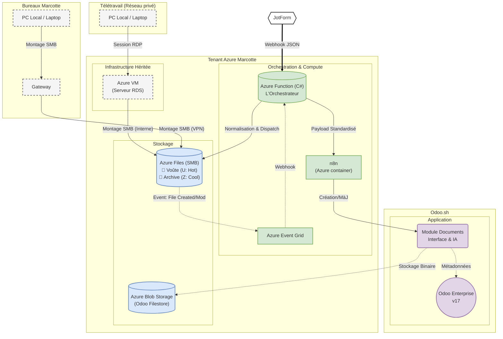

```mermaid
flowchart TD
    %% --- Styles ---
    classDef external fill:#ffffff,stroke:#333,stroke-width:2px;
    classDef compute fill:#d5e8d4,stroke:#82b366,stroke-width:2px;
    classDef storage fill:#dae8fc,stroke:#6c8ebf,stroke-width:2px;
    classDef odoo fill:#e1d5e7,stroke:#9673a6,stroke-width:2px;
    classDef infra fill:#f5f5f5,stroke:#666,stroke-width:2px,stroke-dasharray: 5 5;

    %% --- 1. ENTREE ---
    JotForm{{JotForm}}:::external

    %% --- 2. AZURE CLOUD (Le Cœur) ---
    subgraph Azure [Tenant Azure Marcotte]
        direction TB
        
        subgraph Logic [Orchestration & Compute]
            Orch[("Azure Function (C#)<br/>L'Orchestrateur")]:::compute
            Grid[Azure Event Grid]:::compute
            N8N["n8n<br/>(Azure container)"]:::compute
        end

        subgraph Data [Stockage]
            Files[("Azure Files (SMB)<br/>📂 Voûte (U: Hot)<br/>📂 Archive (Z: Cool)")]:::storage
            Blob[("Azure Blob Storage<br/>(Odoo Filestore)")]:::storage
        end
        
        subgraph Virtualization [Infrastructure Héritée]
            RDS["Azure VM<br/>(Serveur RDS)"]:::infra
        end
    end

	%% --- 3. ODOO (SaaS) ---
    subgraph SaaS [Odoo.sh]
        direction TB
        %% Le Module Documents est maintenant explicite
        subgraph App [Application]
            Docs(Module Documents<br/>Interface & IA):::odoo
            Core((Odoo Enterprise<br/>v17)):::odoo
        end
    end
    
    %% --- 4. UTILISATEURS ---
    subgraph Local ["Bureaux Marcotte<br/>(Réseau interne)"]
        PC[PC Local / Laptop]:::infra
        Gateway[Gateway]:::infra
    end

    %% --- 5. UTILISATEURS TÉLÉ TRAVAIL ---
    subgraph Home["Télétravail (Réseau privé)"]
        PCHOME[PC Local / Laptop]:::infra
    end

    %% --- FLUX DE DONNÉES ---
    
    %% Ingestion
    JotForm -->|Webhook JSON| Orch
    
    %% Logique C# & n8n
    Orch -->|"Normalisation & Dispatch"| Files
    Orch -->|" Payload Standardisé"| N8N
    N8N -->|"Création/MàJ"| Docs
    
    %% Boucle de Rétroaction (Event Driven)
    Files -.->|Event: File Created/Mod| Grid
    Grid -.->|Webhook| Orch

	%% Stockage Odoo : Le Module Documents écrit dans le Blob
    Docs -.->|Stockage Binaire| Blob
    Docs -.->|Métadonnées| Core

    %% Accès Utilisateurs (Le Z:)
    RDS -->|"Montage SMB (Interne)"| Files
    PC -->|"Montage SMB"| Gateway
    Gateway --> |"Montage SMB (VPN)"| Files
	PCHOME -->|"Session RDP"| RDS
    %% Note de liaison
    linkStyle 0 stroke-width:3px,fill:none,stroke:black;
```